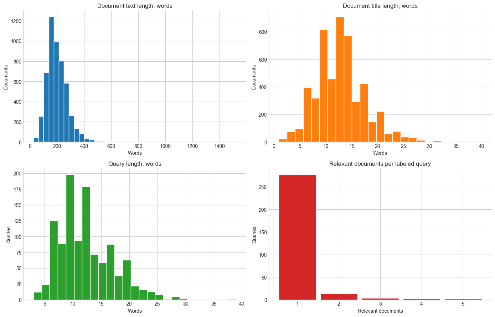
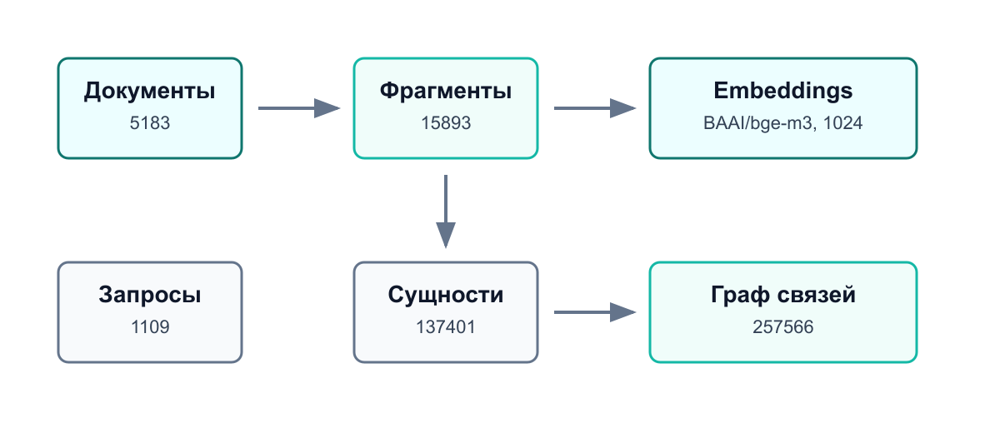
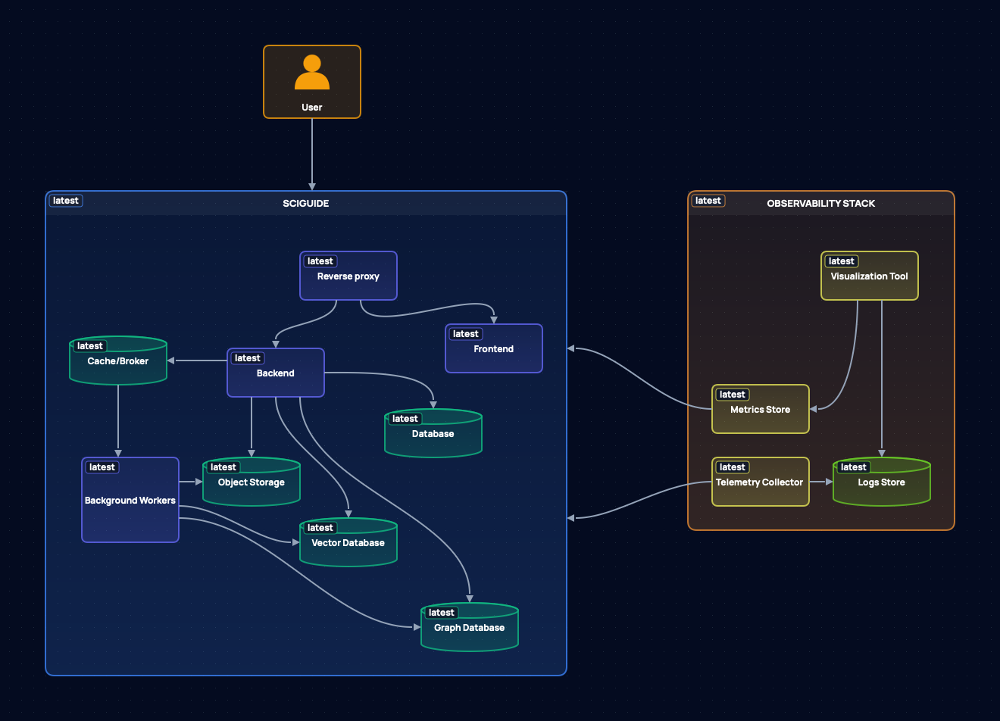
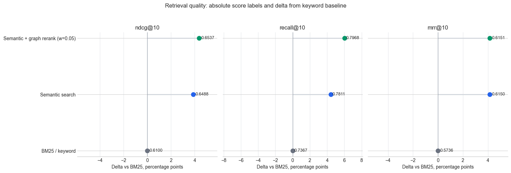
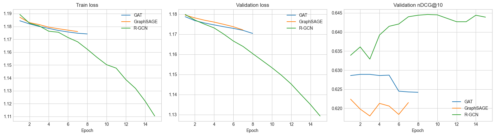
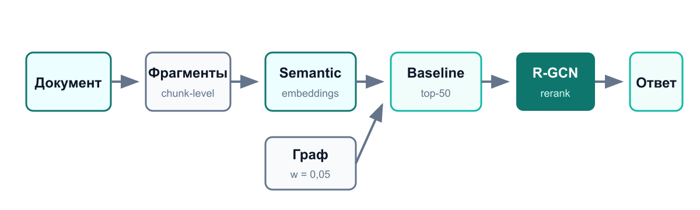

# Цель и задача

**Цель:** разработать систему, которая отвечает по документам выбранного научного направления.

**Ключевая идея:** не доверять LLM без источников, а сначала найти проверяемый контекст.

`вопрос` → `retrieval по корпусу` → `контекст` → `ответ`

# Данные

:::: {.columns}
::: {.column width="70%"}
{width=100%}
:::
::: {.column width="30%"}

**SciFact:** 5183 документа · 1109 запросов · 1258 размеченных пар  
Пустых заголовков и текстов в ключевых полях не обнаружено.
:::
::::

# Подготовка корпуса

{width=98%}

# Архитектура SciGuide

{width=96%}

# Методика оценки

**Оценивается ранжирование документов в top-k.**

- `Recall@10`: нужный источник попал в контекст
- `MRR@10`: первый релевантный документ найден рано
- `nDCG@10`: релевантные документы высоко в выдаче
- train / validation / test разделены по запросам

# Baseline retrieval

{width=100%}

# Обучаемый reranking

**Модель не ищет с нуля, а уточняет top-50 кандидатов baseline.**

```python
final_score = baseline_score + alpha * model_correction
```

| Архитектура | Что проверяет |
|---|---|
| GraphSAGE | простая агрегация соседей |
| GAT | attention к соседям |
| R-GCN | разные типы отношений в графе |

# Сравнение GNN

{width=100%}

# Подбор и переобучение

**Контроль переобучения:** train loss `1,1560`, validation loss `1,1568`.

| Вариант R-GCN | test nDCG@10 | test Recall@10 | test MRR@10 |
|---|---:|---:|---:|
| `64 / 0,15 / 0,0010` | 0,6709 | 0,7989 | 0,6371 |
| `96 / 0,25 / 0,0010` | **0,6754** | 0,8039 | **0,6402** |
| `128 / 0,35 / 0,0005` | 0,6753 | **0,8112** | 0,6386 |

# Итоговый подход

{width=98%}

# Выводы

**Цель достигнута:** реализованы notebook, библиотека `sciguide_pipeline` и сервис SciGuide.

**Лучший результат:** semantic retrieval + слабый графовый сигнал + R-GCN rerank.

**Ограничение:** качество графового сигнала зависит от детерминированного извлечения сущностей.
